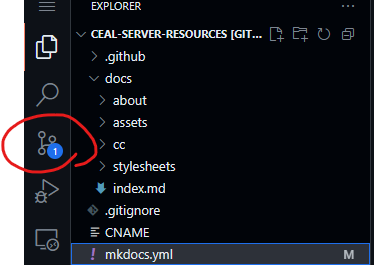
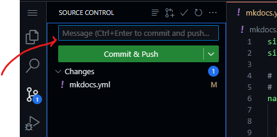

# Tutorials

I will phrase these tutorials as "case studies" of different possible use cases where one may wish to contribute. Hopefully they are also of some paltry humour value.

> *Disclaimer: Any resemblance to actual persons, living or dead, or actual events is purely coincidental.*


-----

## Case Study 1: I just downed six Strong Zeros and wrote a 30,000 word primer on Tangut

Firstly, congratulations? 

Secondly, that's quite a monumental piece of work. So much so that it probably deserves its own section in the site.

### Setting up to work

In GitHub, if you press the dot (period) key `.` on your numpad, you are taken to GitHub's development environment, `github.dev`. ([See documentation for further details](https://docs.github.com/en/codespaces/the-githubdev-web-based-editor)) This is essentially a code editor that is run entirely in your browser. 

Sign in with your GitHub account and let it load the project. You will probably see something akin to this in the top left.


### Creating a new page

You should see a `docs` folder. **All content goes here.**

Find the appropriate folder to put it under. But since what you've written is probably pretty niche, we don't have a category for it yet. You can right click a folder (like `docs`) to create folders and files under it. 

If we go by the server, a sensible categorisation would be:

> 其他 Other > Tangut > A Basic Primer on Tangut

Which we can create a folder structure matching it under `docs` like:

    docs/other/tangut/primer.md

*(Note: file names do not need to match what you see in the navigation)*

### Attaching Images to the Page

Images are referenced using their **relative paths**, using the standard markdown format 

    

This URL can be external (to a different page) or internal (to `ceal.yanwenyuan.uk`).

Suppose you drew some diagrams showing the maze of tangut character decomposition and wanted them in your document. You can put them where the md file is, or in their own folder of images:

    docs/other/tangut/img/

So you upload `diagram1.png`, `diagram2.png`, etc into that folder. Then, in your document, you would write

```
blah blah blah blah blah blah...


blah blah blah...
```


### Adding this page to the navigation 

Right at the top (or rather, right at the bottom, but outside of any folder) you should see a `mkdocs.yml` file.

*(If you can't find it, use Ctrl P \[Cmd + P\] to open up the search bar and type `mkd`- until it shows as the top option, then press enter)*

There's a lot here, but what you care about is this bit:

```yaml
# these will show up in the sidebar
# the structure here is manual, and does not need to match folder structure
nav:
  - 主頁 Home: "index.md"
  - 文言 Classical Chinese: 
    - Beginners Guide: "cc/beginners-guide.md"  # if you do not specify a title, the first heading in the document is used
    ...
  - 關於 About:
    - "about/contribute.md"
  ...
```

This describes the **navigation** of the site -- the tabs at the top and pages down the side. They don't need to match the folder structure but it's useful for organisation.

You'll see two types of bullet points:

- Ones with an indented list underneath (like `- 文言 Classical Chinese: `) are **categories**. The **top level** categories appear as tabs.
- Ones with a single file path ending in `.md` (like `- Beginners Guide: "cc/beginners-guide.md"`) are **pages**. These will take you to a specific page.
    - These paths are the file names **ignoring `docs/`**, so for your primer you would use the path `other/tangut/primer.md`
    - The name before the colon `:` is the **display name**. By default, the site uses the **first top level header in the `.md` file** as the title of the document. In `beginners-guide.md`, it's currently *"Beginner's Guide to Classical Chinese"*, but in the sidebar it just shows up as *Beginners Guide*
  
Hence, we would write something like:

```yaml
nav:
  - 主頁 Home: "index.md"
  - 文言 Classical Chinese: 
    - Beginners Guide: "cc/beginners-guide.md" 
    ...
  ...
  # WE WOULD WRITE HERE:
  - 其他 Other:
    - Tangut:
        - "other/tangut/primer.md"
```

Alternatively, if you wanted to give it a short name, you could do 

```yaml
nav:
  ...
  - 其他 Other:
    - Tangut:
        - Primer: "other/tangut/primer.md"
```

### Submitting your work

Now you need to "commit your changes", "fork the repository", "make a pull request", and wait for it to be accepted.

*(Your local friendly LLM may be able to help here more than whatever I write)*

Click on the icon shown in the image, that should be under the search icon. This is the "version control" tab. It's where you see all your changes and can "commit" (read: finalise) them.



Hover over the word `Changes` and you should see a plus icon appear. Click that to add all changes. If you only want certain files, here's where you can pick and choose.


Type a message in the message box, to summarise what you've done. **This should be succinct and in present tense, e.g. "Write primer on Tangut"**.



Then click `Commit & Push`

### Forking off

Now, you likely won't have write access to my project. Hence, a window should pop up saying as much, and asking if you want to **Fork** this repository. This is like creating a linked duplicate on your own account that you can write to, and then request the changes you make to be "merged" into mine.

So click yes, it'll ask you for a "branch name", don't worry about this too much, leave it as `patch-1` or call it `main` or something.

Once you click ok and it finishes what it's doing, it should ask if you want to switch to your fork of the project. Click *yes*. 

Now in future, any changes you make will go into your copy of the project. **They haven't been added to the main site yet though!**

### Merging back

Now when you go to your GitHub account, and go to your repositories, you should see `<Your Name>/ceal-server-resources` there. 

There should be a yellow banner saying that some branch has recent changes, with a green button to "Compare and Pull Request". Click this and make a pull request -- this is a request to add your changes to my project.

If not, there should still be a banner with a button saying "Contribute", go into it and click the big "Open pull request".

For more information, see [GitHub's official documentation](https://docs.github.com/en/pull-requests/collaborating-with-pull-requests/proposing-changes-to-your-work-with-pull-requests/creating-a-pull-request) or just asking your favourite LLM to walk you through the process.

**Please ping me (yanwenyuan) on one of the discord channels in CEAL if I don't know who you are.**

Once I accept your changes, they'll be live within minutes!

### Wait, there have been more recent changes since my fork?

Multiple people may be modifying the website at once, and your fork does not automatically sync to my main site. You should see a banner on your fork that says "This branch is \[X commits ahead of,\] X commits behind `yanwenywan/ceal-server-resources:master`" (or something to that effect)

**Before you make a pull request**, you can sync the branches by clicking the "Sync fork" in the banner and following through with the GitHub UI. 

***If you click discard commit, you will lose all your changes! The ONLY time you should click this, is when you are sure all the changes on your fork have been copied over and live on the main site, and you wish to make the update log match.***

-----

## Case Study 2: I found a pdf of this Classical Chinese-English dictionary that went out of print in 1976

Upload it to Google Drive (or Yandex, or whatever else you want that allows downloads without an account, I will not accept Baiduyun), and get a public viewing link for the file.

*Note:* ***Please don't upload large PDFs or other large files directly to this repository.*** *Especially if they are acquired through "roundabout" means. Not fussed about third party file host links though.*

Then, navigate to the appropriate dictionary page, which should be 

> 文言 Classical Chinese > Dictionaries > Chinese-English Dictionaries

And add yours to the list, and commit your changes as described in Case Study 1.

*(Note: if the page or parent folders are not present, please ping maxim or someone until they get round to it. This tutorial was written at a time where said page only lives in the figments of our imagination)*

