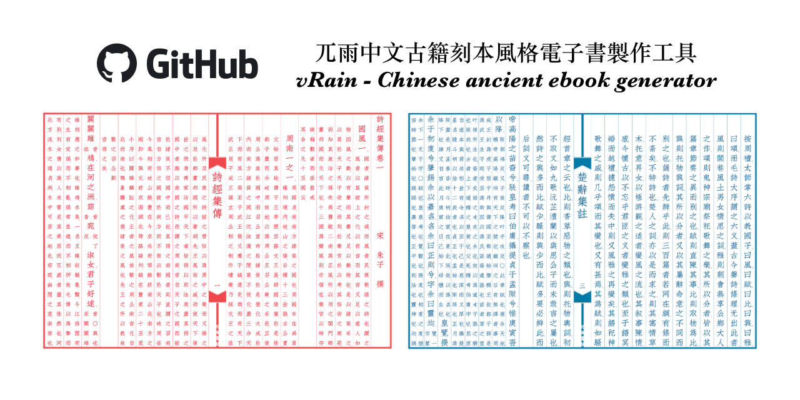

# General Resources
## Recommended Fonts

### Open source fonts
[Open source](wikipedia link here) fonts are freely available, modifiable, and redistributable, and generally able to be used in all contexts including commercial ones. This is not legal advice; ensure you understand the license terms of each one.

Here are some open source Hanzi fonts:

- [文津宋體 / 文津明朝 / WenJinMincho](https://github.com/takushun-wu/WenJinMincho): A large Han-ideograph character set Songti (Mincho) font suite mainly derived by [Source Han Serif](https://github.com/adobe-fonts/source-han-serif) and Han glyphs generated by [modified Kage engine](https://github.com/ge9/kage-engine-2/), and the glyphs are mainly presented in China mainland glyphs standard (aka G source).
- [超威德鑫 9pt 小篆 / SuperDexin-9pt-Zhuan](https://github.com/SuperDexin/9pt-Zhuan): A font of Seal script (篆書).

### Other fonts
These fonts are either not open source, or I haven’t been able to locate their source yet.

- [天珩字庫 / TH Fonts](http://cheonhyeong.com/English/download.html): More than 140,000 Chinese Characters are supported, and mainly designed as the style the mainland of China uses. What is more, it supports all the characters in Unicode15.1, including the emojis.
- [OB Fonts](https://disk.yandex.ru/d/3yXCbPy02ON8Tg): OB font(s) from an old Japanese website.

## eBook Generator
Now you can read your favourite cc books on screen!

- [vRain - 中文古籍刻本風格直排電子書製作工具 Chinese Ancient eBooks Generator](https://github.com/shanleiguang/vRain): The goal of this project is to create ebook in text format that replicates the original appearance of the ancient books, supporting annotations and queries, making it convenient to store in ebook-readers for reading anytime. The elegant and immersive reading experience brought by the primitive form of ancient books may attract more readers to enjoy reading ancient literature.

- [zhvt-classic 中文线装书模板](https://github.com/chianjin/zhvt-classic): This is a [LaTeX](https://www.latex-project.org/about/) macro which produces a typesetting layout with these common traditional Chinese thread-bound book format: border lines, inner margins, table of contents, preface, jiazhu, and support for title pages, images, and punctuation marks.

## Recommended Dictionaries
### Yomitan Dictionaries
### MDicts
### Pleco
### More minor recommendations
### High Frequency Function Words
### DDB app, and whatever else
## Yomitan and Anki setup (sentence mining explanation)
## Cool blogs/twitter accounts/youtube/bilibili channels
  - [山村訓長但知覓](https://sanchonhunjang.blogspot.com/?m=1): 
  - (https://web.archive.org/web/20190401171838/https://kuiwon.wordpress.com/): 
  - [Wengu - Chinese Classics](http://wengu.tartarie.com/wg/wengu.php?l=intro): Read Chinese classics in original version and western language translations. / Lire les classiques chinois en version originale et traductions dans des langues occidentales.
  - http://chinaknowledge.org/ also confusingly http://www.chinaknowledge.de/ is the old site thats sorta still up? use the .org since it seems more stable: An Encyclopaedia on Chinese History, Literature and Art.
  - [sinoxenic](https://sinoxenic.wordpress.com/): dé l'Orient no l'Occident
  - [David K. Jordan's Homepage (USCD)](https://pages.ucsd.edu/~dkjordan/chin/china.html#language): The linked pages have been prepared for use in classes relating to China and may be assigned for direct use on-line if desired.

## Japanese/Kanbun specific resources for CC
## Korean specific resources for CC
## Vietnamese specific resources for CC
